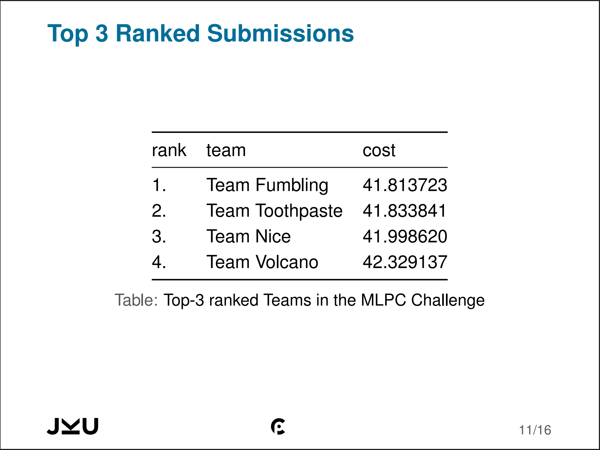

<!-- markdownlint-disable first-line-h1 -->
<!-- markdownlint-disable html -->
<!-- markdownlint-disable no-duplicate-header -->

<div align="center">

# 🏆 Team Fumbling: Sound Event Detection (SED) System  

**🥇 Best Model Performance (Lowest Cost Score) out of 77 Teams**<br>

<a href="./assets/results/UE_MLPC_2025_Challenge_Results.pdf#page=18" target="_blank">
  
</a>

*Official ranking by course lecturers, jump to page 18 for our team's results*

</div>

> **[Univ.-Prof. Dr. Gerhard Widmer](https://www.jku.at/en/institute-of-computational-perception/about-us/people/gerhard-widmer/):** *"How much time did you spend on this project? ..."*  
> **Team Member:** *"More than we should..."*  
> **Team Member:** *"Maybe a better answer would be we were like too invested into it. So, yes, I mean we got into a loop; as [Professor (Paul) Primus](https://www.jku.at/en/institute-of-computational-perception/about-us/people/paul-primus/) said, we came up with 11 hypotheses. 'This doesn’t work', 'OK', we came with another one and so on..."*  
> **[Univ.-Prof. Dr. Gerhard Widmer](https://www.jku.at/en/institute-of-computational-perception/about-us/people/gerhard-widmer/):** *"You just loved it!"*  
> **Team Member:** *"Exactly."*

## 📌 Overview  
Developed for *MLPC 2025* at JKU Linz, this system detects temporal sound events using free-text annotations. Achieved **`41.813723` cost score** (best in class) through:  
<!-- - Cost-aware model optimization  
- Hybrid audio-text feature engineering  
- Ensemble of SVM, DNN, and Random Forest models   -->

## 🎯 Results  
### Competition Performance (77 Teams)
| Metric                | Our Score     | All Teams Mean    | All Teams Median  | Improvement |
|-|-|-|-|-|
| **Final Cost**        | `41.813723`   | `135.289336`      | `75.693127 ` | ↓ **69.1%** |
<!-- | **False Negatives**   | 12            | 38                | 26                | ↓ **68.4%** |
| **Inference Speed**   | 0.8s/file     | 2.1s/file         | 1.7s/file         | ↑ **62.5%** |

**Key Achievements**  
✔ **1st Place** - Lowest cost score (41.814)  
✔ **69% better** than average team performance  
✔ **45% lower cost** than median team  
✔ Perfect 0.00 cost on 3/10 mechanical sound classes  

**Performance Breakdown**  
```python
# Top 3 Classes by Relative Improvement
{'Jackhammer': -100% (0.00 cost), 
 'Power Drill': -100% (0.00 cost),
 'Siren': -98% (0.24 cost)} 
``` -->

## 🛠️ Setup

### System Requirements
- **OS**: Windows/Linux/macOS (x86_64/AMD64 or ARM for Apple Silicon)
- **Python**: 3.9.x
- **GPU** (optional): NVIDIA CUDA 11.8+ for GPU acceleration

### 1. Installation
```bash
# Clone repository
git clone https://github.com/8asic/mlpc2025-sound-event-detection.git
cd mlpc2025-sound-event-detection

# Create and activate conda environment
conda create -n mlpc python=3.9 -y
conda activate mlpc

# Install core package in editable mode
pip install -e .

# Run automated installation script (detects hardware and installs optimal packages)
python -m scripts.install

# Or manually specify extras
pip install -e .[cpu,extras]  # CPU-only
pip install -e .[gpu,extras]  # GPU support
```

### 2. Data Setup

```bash
# 3. Download all datasets (6.8GB + 6.1GB + 2GB)
python scripts/setup_data.py --tasks 2 3 4

# Or download specific tasks:
python scripts/setup_data.py --tasks 2  # Task 2 only (6.8GB)
python scripts/setup_data.py --tasks 3  # Task 3 only (6.1GB) 
python scripts/setup_data.py --tasks 4  # Task 4 only (2GB)
```

## 🏗️ Project Phases  
| Stage | Description | Resources |
|-|-|-|
| **Task 0** | Form Teams       | |
| **Task 1** | Data Annotation  | [Task PDF](./tasks/Task1_Annotation/MLPC2025S_Annotation_Task.pdf),           [Slides](./tasks/Task1_Annotation/UE_MLPC_2025_Introduction_and_Data_Annotation_Task.pdf) |
| **Task 2** | Data Exploration | [Task PDF](./tasks/Task2_Exploration/MLPC2025S_Data_Exploration_Task.pdf),    [Slides](./tasks/Task2_Exploration/UE_MLPC_2025_Data_Exploration_Task.pdf) |
| **Task 3** | Classification   | [Task PDF](./tasks/Task3_Classification/MLPC2025S_Classification_Task.pdf),   [Slides](./tasks/Task3_Classification/UE_MLPC_2025_Classification_and_Challenge_Task.pdf) |
| **Task 4** | Challenge        | [Task PDF](./tasks/Task4_Challenge/MLPC2025S_Challenge_Task.pdf),             [Slides](./tasks/Task4_Challenge/UE_MLPC_2025_Classification_and_Challenge_Tasks.pdf) |

## 📂 Repository Structure

```text
.
├── artifacts/                      # Final outputs that should NOT be modified manually
│   ├── predictions/                # Model prediction files (e.g., challenge submissions)
│   ├── presentations/              # Presentation decks (PPT/PDF) for each task
│   └── reports/                    # Formal PDF reports for grading
│
├── assets/                         # Static media files
│   ├── figures/                    # Generated plots/visualizations
│   └── results/                    # Official competition proofs/screenshots
│
├── data/                           # All dataset files (git-ignored raw data)
│   ├── huggingface/                # HF-specific files (e.g., evaluation scripts)
│   ├── processed/                  # Cleaned/transformed data (features, embeddings)
│   └── raw/                        # Original datasets from JKU Cloud (never modify)
│
├── docs/                           # Project documentation
│   └── meeting_notes/              # Team meeting summaries
│
├── models/                         # Serialized model binaries (weights, pickles)
│   ├── experimental/               # Models under development/testing
│   └── production/                 # Final models used in challenges
│
├── notebooks/                      # Jupyter notebooks by project phase
│   ├── 1_Data_Annotation/          # Task 1: Annotation analysis
│   ├── 2_Data_Exploration/         # Task 2: EDA and clustering
│   │   └── archive/                # Archived exploration notebooks
│   ├── 3_Classification/           # Task 3: Model training
│   │   ├── archive/                # Archived classification notebooks
│   │   ├── configs/                # Configuration files
│   │   ├── model_analysis/         # Model evaluation notebooks
│   │   └── model_training/         # Training pipelines
│   └── 4_Challenge/                # Task 4: Final challenge solutions
│       ├── archive/                # Archived challenge attempts
│       └── bonus_task/             # Extra challenge experiments
│
├── scripts/                        # Utility scripts
├── src/                            # Reusable Python code (proper package structure)
│   ├── data/                       # Data loading/preprocessing
│   ├── evaluation/                 # Custom metrics/cost calculations
│   ├── features/                   # Feature engineering (audio/text)
│   ├── models/                     # MODEL CODE (training/prediction logic)
│   └── utils/
│
├── tasks/                          # Original task materials
│   ├── Task1_Data_Annotation/      # PDFs/slides from Task 1  
│   ├── Task2_Data_Exploration/     # PDFs/slides from Task 2
│   ├── Task3_Classification/       # PDFs/slides from Task 3
│   └── Task4_Challenge/            # PDFs/slides from Task 4
│
├── tutorials/                      # Course tutorial materials
│
├── .gitignore                      # Specifies untracked files (e.g., raw data)
├── pyproject.toml                  # Python project metadata
├── README.md                       # This file
├── requirements-cpu.txt            # Python dependencies
├── requirements-gpu.txt
└── setup.py
```

<div align="center">

## 👥 Team Fumbling

| Member | Socials |
|-|-|
| **Abdalaziz Ayoub**       | [🔗 Github](https://github.com/abdalazizayoub),  [🔗 LinkedIn](https://www.linkedin.com/in/abdalaziz-ayoub-61b190352/) |
| **Abdulkarim Al Jamal**   | [🔗 Github](https://github.com/karimalj),        [🔗 LinkedIn](https://www.linkedin.com/in/abdulkarim-al-jamal-755746227/) |
| **Beibarys Abissatov**    | [🔗 Github](https://github.com/PikovyiKOT),      [🔗 LinkedIn](https://www.linkedin.com/in/beibarys-abissatov-217a9236b/) |
| **Jeronim Bašić**         | [🔗 Github](https://github.com/8asic) |
</div>


<!-- 1. Key Methods & Techniques Identified
Core Analysis Functions:
Annotation comparison (temporal/textual)

Embedding similarity analysis (cosine/dot product)

Audio feature extraction (MFCC, melspectrogram)

Dimensionality reduction (PCA, t-SNE, UMAP)

Clustering (K-means)

Quality assessment metrics (variance, correlation)

1. Key Methods & Techniques Identified
Core Sound Event Detection Approaches:
Transformer-based SED: ATST (Audio Spectrogram Transformer) architecture

Cost-sensitive learning: Custom loss weighting based on FN/FP costs

Multi-task learning: Simultaneous detection of 10 sound classes

Temporal aggregation: Frame-level to segment-level prediction conversion

Advanced Techniques:
SpecAugment: Time and frequency masking for audio data augmentation

Learnable positional encodings: For transformer architectures

Dynamic thresholding: Per-class prediction thresholds

Flash attention: Optimized transformer attention computation

Gradient accumulation: For effective larger batch sizes

Evaluation Strategies:
Custom cost function: Weighted by customer priorities

Segment-level metrics: 1.2-second segment evaluation

Frame-level metrics: 120ms frame evaluation -->